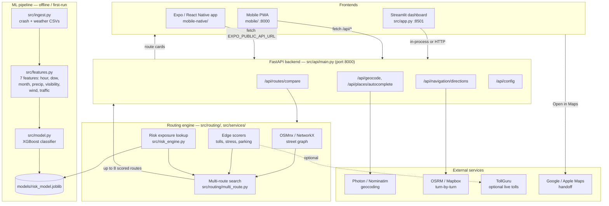

# MyDrive

**A Chicagoland route planner that compares up to 8 driving options by time, cost, stress, and a machine-learning accident-risk score — then hands you off to Google or Apple Maps to actually drive.**

[](https://www.python.org/)
[](https://fastapi.tiangolo.com/)
[](https://streamlit.io/)
[](https://www.openstreetmap.org/)

> Safety scores are predictions based on historical patterns, not guarantees. Always drive alert, and only interact with the phone UI while parked.

---

## What this is

MyDrive is a demo/portfolio route planner focused on the Chicago area. You type a starting address and a destination (or pick one of the built-in popular trips, like "The Loop to O'Hare"), and instead of giving you one route, it gives you **several route options at once**, each optimized for something different:

- **Fastest** — shortest drive time
- **Cheapest** — lowest toll cost
- **Calm** — fewer highways, less stressful driving
- **Safest** — lowest predicted accident risk, adjusted for the weather and time of day you're leaving
- **Steady ETA** — more predictable road types
- **Balanced** — a mix of all of the above
- **Parking-friendly** — routes that end near easy parking
- **Your pick** — you set your own mix of priorities

The "safest" score comes from a machine-learning model trained on historical crash and weather data. It doesn't just say "this road is dangerous" in the abstract — it adjusts for when you're actually leaving: driving at night, during rush hour, in heavy rain, or in low visibility all push the risk score up, and the app tells you in plain English why ("Night driving trend (+18%)", "Heavy precipitation (+45%)", etc.).

Once you've picked a route, MyDrive doesn't try to be your turn-by-turn navigation app. It hands off to **Google Maps or Apple Maps** with one tap — the idea is that MyDrive helps you decide *which* route to take, and your phone's native navigation app gets you there.

The app itself ships in three forms that all talk to the same backend: a **Streamlit dashboard** (good for a full side-by-side comparison table on a laptop), a **mobile-friendly PWA** (installable on your phone's home screen, with a simplified "passenger mode" and voice input), and an optional **Expo/React Native shell** (the same experience wrapped as a native app you can run via Expo Go).

---

## Key features

- **Multi-route comparison** — up to 8 routes per trip across 7 presets plus a custom "Your pick" priority mix
- **ML accident-risk prediction** — an XGBoost classifier trained on fused crash + weather history, producing a `P(accident)` score mapped onto individual road segments
- **Weather- and time-aware risk adjustment** — a rules-based multiplier (0.6×–2.5×) layered on top of the spatial risk score, driven by departure hour, day of week, precipitation, visibility, wind, and a traffic-volume proxy, with human-readable explanations
- **Real road network data** — routes are computed on the actual OpenStreetMap drivable street graph for the Chicago area (via OSMnx/NetworkX), not straight-line estimates
- **Toll- and stress-aware scoring** — toll costs come from OSM tag data plus a configurable toll-rate table; "stress" is a function of road type (highway-heavy vs. surface streets)
- **Three synchronized frontends** — Streamlit (desktop), a PWA (mobile web, installable), and an Expo/React Native app — all calling the same FastAPI backend
- **Maps handoff** — one tap opens the chosen route in Google Maps or Apple Maps; there is also a lightweight in-app turn-by-turn mode via OSRM/Mapbox for when you don't want to leave the app
- **Self-bootstrapping demo data** — on first run, the app generates synthetic Chicagoland crash/weather history and trains the risk model automatically, so it works out of the box with no external API keys

---

## How it works

### End-to-end flow

1. **You enter a trip.** Origin and destination addresses (typed, autocompleted, or picked from a popular-trip/destination shortcut) are geocoded to latitude/longitude via Photon/Nominatim (or Mapbox, if you've configured a token).
2. **The road network is loaded.** OSMnx downloads (and caches) the OpenStreetMap drivable street graph for a bounding box around the trip, then converts it into a NetworkX graph.
3. **Every road segment gets a risk score.** The XGBoost accident model — trained offline on historical crash + weather features — scores locations across the network. Segment-level risk is nearest-neighbor-matched from those scored points onto the OSM graph edges.
4. **Weather/time context adjusts risk.** Given your departure time (and optional live weather inputs, or "typical" weather looked up from the historical data for that hour/month), a rules engine computes a risk multiplier and a list of plain-English factors (night driving, rush hour, rain, low visibility, wind, traffic).
5. **Tolls, stress, and parking are scored per edge.** Toll cost comes from OSM tag data plus `config/toll_rates.yaml` (or a live TollGuru lookup if you supply an API key); "stress" is derived from road type (highways vs. calmer surface streets); parking-friendliness comes from nearby OSM parking data.
6. **Multiple shortest-path searches run against different edge-weight blends.** Each preset (fastest, cheapest, calm, safest, steady ETA, balanced, parking-friendly, or a custom "Your pick" weight mix) reweights the graph edges differently and re-runs a shortest-path search, producing up to 8 distinct, comparable routes.
7. **Results are returned to whichever frontend asked.** The FastAPI backend exposes this whole pipeline over `/api/routes/compare`; the Streamlit app, the PWA, and the Expo app are all just different clients of the same API (Streamlit also has the option to call the routing engine in-process).
8. **You pick a route and hand off to navigation.** Every route card includes buttons to open the route directly in Google Maps or Apple Maps for actual turn-by-turn driving; an optional in-app map mode uses OSRM or Mapbox for directions without leaving MyDrive.

### Architecture



### The ML risk model, in more detail

```text
Crash CSV + weather CSV  →  fuse by hour  →  7 features  →  XGBoost  →  risk_score (0–1) per location
                                                                             │
                                                                             ▼
OpenStreetMap graph  →  nearest-segment risk lookup  ×  weather/time multiplier  →  "Safest" route weighting
```

- **Training features (7):** hour of day, day of week, month, precipitation, visibility, wind speed, and a traffic-volume proxy (`src/features.py`).
- **Model:** `XGBClassifier` (300 trees, max depth 5, learning rate 0.1) trained with an 80/20 stratified train/test split, evaluated with ROC-AUC (`src/model.py`). The trained model is serialized to `models/risk_model.joblib` with `joblib`.
- **Inference:** `src/risk_engine.py` builds a `WeatherContext` from either manual inputs or a "typical weather for this month/hour" lookup computed from the fused historical data, then applies a bounded (0.6×–2.5×) multiplier with human-readable factors like "Night driving trend (+18%)" or "Heavy precipitation (+45%)".
- **Bootstrapping:** since real Chicago crash/weather datasets aren't bundled, `scripts/generate_sample_data.py` synthesizes ~720 hours of realistic Chicagoland crash + weather history, and the full ingest → feature → train pipeline runs automatically on first launch (`ensure_demo_pipeline()`), so there's nothing to configure to see it work.

### How the three frontends differ

| Frontend | Tech | Port | Best for |
|---|---|---|---|
| Streamlit dashboard | Python, `streamlit` + `streamlit-folium` (`src/app.py`, entry point `streamlit_app.py`) | 8501 | Full comparison table, map, laptop demos |
| PWA | Plain HTML/CSS/JS (`mobile/`), served by the FastAPI app itself, installable via "Add to Home Screen" | 8000 | Phone use, passenger mode, voice input, offline caching of recent routes |
| Expo / React Native | React Native + Expo SDK 52 (`mobile-native/`) | Expo Go | Native app shell with haptics, GPS, spoken route summaries (`expo-speech`), Maps deep links |

All three ultimately call the same routing/risk logic — the PWA and Expo app do it over HTTP against the FastAPI server; the Streamlit app can call the engine functions directly in-process or over HTTP.

---

## Tech stack

- **Language:** Python 3.10+ (backend, ML, Streamlit), TypeScript/JavaScript (Expo app, PWA)
- **ML:** XGBoost, scikit-learn, pandas, numpy, joblib
- **Geospatial / routing:** OSMnx, NetworkX, GeoPandas, Shapely, pyproj
- **Backend API:** FastAPI, Pydantic, Uvicorn
- **Desktop UI:** Streamlit, streamlit-folium, Folium/Leaflet
- **Mobile web:** vanilla HTML/CSS/JS PWA with a service worker (`mobile/sw.js`) for offline caching
- **Native app:** Expo (SDK 52), React Native, `react-native-maps`, `expo-location`, `expo-speech`, `expo-linking`
- **Data sources:** OpenStreetMap (roads), Photon/Nominatim (geocoding), OSRM (directions, default public router), optional Mapbox (autocomplete/turn-by-turn) and TollGuru (live toll pricing)

---

## Project structure

```text
MyDrive/
├── streamlit_app.py         # Streamlit entry point
├── requirements.txt         # Python dependencies
├── .env.example             # optional API keys / config (TollGuru, Mapbox, OSRM, Expo API URL)
├── config/                  # brand config, Chicagoland trip presets, toll_rates.yaml
├── data/
│   ├── sample/                # committed demo crash + weather CSVs
│   └── processed/             # generated: fused.csv, features.csv (gitignored)
├── models/                  # generated: risk_model.joblib (gitignored)
├── notebooks/                # exploratory notebooks
├── reports/                   # generated output, e.g. route_comparison.csv
├── cache/                     # OSMnx graph cache
├── src/
│   ├── app.py                  # Streamlit UI
│   ├── demo.py                  # ensure_demo_pipeline() — first-run bootstrap
│   ├── ingest.py                 # loads/fuses raw crash + weather CSVs
│   ├── features.py                # builds the 7-feature ML training set
│   ├── model.py                    # XGBoost training + evaluation
│   ├── risk_engine.py               # weather/time risk multiplier + explanations
│   ├── geocode.py, places.py         # geocoding + address autocomplete
│   ├── brand.py                       # brand/app name config
│   ├── navigation/
│   │   └── directions.py                # OSRM/Mapbox turn-by-turn lookup
│   ├── routing/
│   │   ├── multi_route.py                # RouteWeights + multi-preset shortest-path search
│   │   ├── scorers.py                     # per-edge stress/risk scoring
│   │   ├── tolls.py                        # toll cost estimation
│   │   ├── parking.py                       # parking-proximity scoring
│   │   ├── geo_utils.py                      # projections, haversine, bbox helpers
│   │   └── osm_tags.py                        # OSM tag interpretation
│   ├── services/
│   │   └── route_service.py                 # shared logic called by both API and Streamlit
│   └── api/
│       └── main.py                          # FastAPI app: all /api/* endpoints
├── mobile/                   # PWA: HTML/CSS/JS, manifest.json, service worker (sw.js)
├── mobile-native/            # Expo/React Native app (package.json, App entry, assets)
└── scripts/
    ├── dev.sh                    # main entry point: setup | mobile | desktop | expo | check
    ├── generate_sample_data.py    # synthesizes demo crash/weather CSVs
    ├── setup_demo_data.py          # runs ingest → features → model training
    ├── compare_routes.py            # CLI to dump a route comparison to CSV
    └── run_demo.sh, run_mobile.sh, run_expo.sh, verify.sh, lib.sh
```

---

## Setup / running locally

### One-time setup

```bash
git clone https://github.com/rsheth8/MyDrive.git
cd MyDrive
./scripts/dev.sh setup      # creates .venv, installs Python + npm deps, builds demo data
```

This creates a Python virtualenv, installs `requirements.txt`, generates synthetic demo crash/weather data, runs the ingest → feature → train pipeline once, and installs the Expo app's npm dependencies.

### Run the mobile API + PWA

```bash
./scripts/dev.sh mobile     # FastAPI + PWA on http://localhost:8000
```
Equivalent to: `python -m uvicorn src.api.main:app --host 0.0.0.0 --port 8000 --reload`
On your phone (same Wi-Fi), open `http://<your-mac-lan-ip>:8000` and use Safari's "Add to Home Screen" to install it as a PWA.

### Run the Streamlit desktop dashboard

```bash
./scripts/dev.sh desktop    # Streamlit on http://localhost:8501
```
Equivalent to: `streamlit run streamlit_app.py`

### Run the Expo/React Native app

```bash
./scripts/dev.sh mobile     # terminal 1 — API must be running first
./scripts/dev.sh expo       # terminal 2 — scan the QR code with the Expo Go app
```
Equivalent to (inside `mobile-native/`): `npx expo start --go`, with `EXPO_PUBLIC_API_URL` pointed at your machine's LAN IP.

### Health check

```bash
./scripts/dev.sh check      # verifies venv, demo data, running API, Expo deps
```

### Optional configuration

Copy `.env.example` to `.env` to set:
- `TOLLGURU_API_KEY` — live toll pricing instead of the static rate table
- `MAPBOX_ACCESS_TOKEN` — better geocoding/autocomplete and turn-by-turn
- `OSRM_BASE_URL` — point at a self-hosted OSRM instance instead of the public router
- `EXPO_PUBLIC_API_URL` — the LAN URL the Expo app should call (set automatically by `dev.sh expo`)

None of these are required — the app works fully with synthetic demo data and free/public services out of the box.

### Deployment

See [DEPLOY.md](DEPLOY.md) for deploying the Streamlit app to Streamlit Community Cloud, and [MOBILE.md](MOBILE.md) for more detail on the PWA and Expo app.

---

## Notable implementation details

- **No external ML data dependency:** since real Chicago crash/weather datasets aren't bundled, `scripts/generate_sample_data.py` produces ~720 hours of synthetic data with realistic patterns, and the whole ingest/feature/train pipeline (`ensure_demo_pipeline()` in `src/demo.py`) runs automatically on first launch — the app is self-contained and works without any API keys or manual data prep.
- **Risk is two layers, not one:** a spatial layer (XGBoost score per road segment, from historical patterns) is multiplied by a temporal/weather layer (a simple, bounded, explainable rules engine in `risk_engine.py`), so the "Safest" route reflects both *where* crashes tend to happen and *when/under what conditions* they're more likely.
- **The multiplier is deliberately simple and explainable** rather than a second ML model — it's capped to 0.6×–2.5× to keep results readable, and every adjustment is surfaced to the user as a plain-English factor (e.g., "Rush-hour trend (+12%)").
- **Multi-route generation is weight-based, not path-enumeration-based:** each preset is a different `RouteWeights` blend (time, money, stress, risk, reliability, parking) that reweights the same OSM graph and re-runs shortest-path search — this is why up to 8 "different" routes can be produced from one graph rather than needing 8 separate routing algorithms.
- **Live traffic and live weather forecasts are explicitly not implemented** — the API exposes a placeholder `/api/traffic/status` endpoint, and weather defaults to historical "typical for this hour/month" values unless the caller supplies manual weather inputs.
- **MyDrive intentionally doesn't replace your navigation app.** There's a lightweight in-app turn-by-turn mode (OSRM/Mapbox), but the primary supported pattern is picking a route in MyDrive and tapping through to Google Maps or Apple Maps — CarPlay/Android Auto integration is out of scope for v1 since it requires platform entitlements.
- **Graph downloads are cached** (`cache/`) since OSMnx has to fetch OpenStreetMap tiles over the network on first request for a given area, which can otherwise make first-route latency noticeably higher.

---

## License

See repository license. Built as a portfolio/demo project for exploring Chicagoland driving decisions — not a substitute for professional navigation or safety systems.
